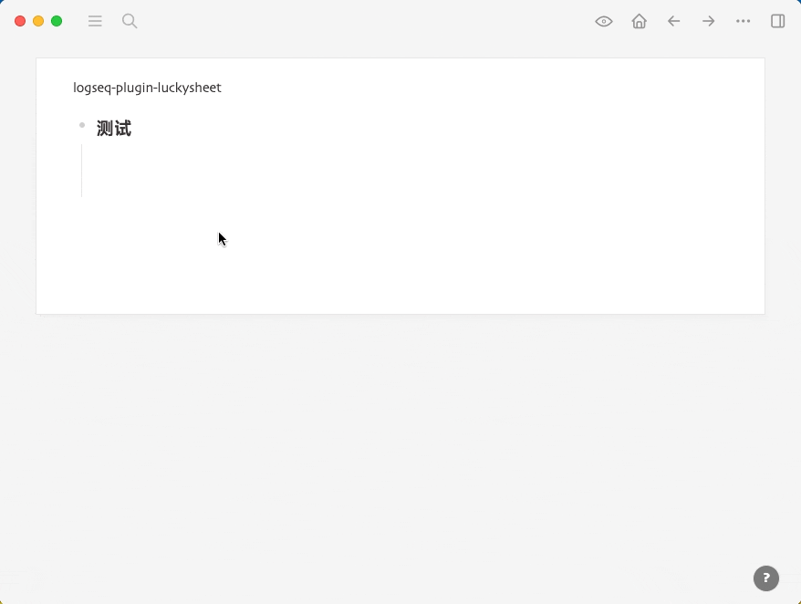

# logseq-plugin-luckysheet

在 Logseq 中嵌入电子表格 Luckysheet。你也可以用它来维护一张 markdown 表格。

表格数据存储在第一个子块下，**注意不要去手动修改**。

Embed Luckysheet (spreadsheet) into Logseq. You can also use it to maintain a markdown table.

Spreadsheet data is stored under the first child block, **do not alter it manually**.

## 使用展示 (Usage)



## 使用示例 (Examples)

```
{{renderer :luckysheet, workbook name}}
```

## 免责声明 (Disclaimer)

本插件中使用的表格是第三方的开源软件 [Luckysheet](https://github.com/mengshukeji/Luckysheet)，非插件作者维护。插件作者不对由此带来的可能数据丢失或错误负任何直接或间接责任。

The spreadsheet used in this plugin is a third party open source software [Luckysheet](https://github.com/mengshukeji/Luckysheet) and is not maintained by the plugin author. The plugin author is not responsible, directly or indirectly, for any possible loss of data or errors arising therefrom.
